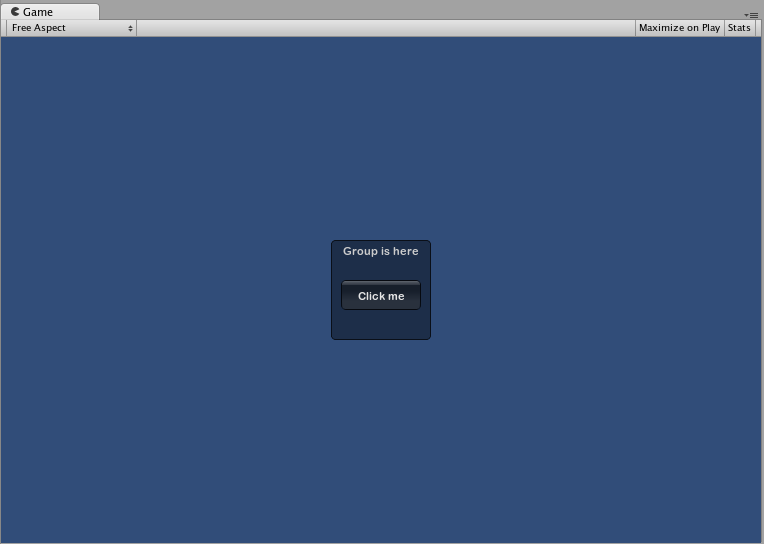

# GUI

Unity 的 IMGUI 控件使用一个名为 OnGUI() 的特殊函数。只要启用包含脚本，就会在每帧调用 OnGUI() 函数，就像 Update() 函数一样。

## 声明 GUI 控件时，需要三段关键信息：

**Type** (**Position**, **Content**)

可以看到，此结构是一个带有两个参数的函数。我们现在将探讨此结构的细节。

#### Type

**Type** 是指 **Control Type（控件类型）\_\_；通过调用 Unity 的** [**GUI 类**](https://docs.unity3d.com/cn/2021.1/ScriptReference/GUI.html)**或** [**GUILayout 类**](https://docs.unity3d.com/cn/2021.1/ScriptReference/GUILayout.html)**中的函数来声明该类型（在本指南的**[**布局模式**](https://docs.unity3d.com/cn/2021.1/Manual/gui-Layout.html)**部分对此进行了详细讨论）。例如，\_\_GUI.Label()** 将创建非交互式标签。本指南稍后的[控件](https://docs.unity3d.com/cn/2021.1/Manual/gui-Controls.html)部分将介绍所有不同的控件类型。

#### Position

**Position** 是所有 **GUI** 控件函数中的第一个参数。此参数本身随附一个 **Rect()** 函数。**Rect()** 定义四个属性：\_\_最左侧位置\*\*、**最顶部位置**、**总宽度**、**总高度**。所有这些值都以\_\_整数\_\_提供，对应于像素值。所有 UnityGUI 控件均在\_\_屏幕空间 (Screen Space)\*\* 中工作，此空间表示已发布的播放器的分辨率（以像素为单位）。

控件种类

Button,InputField,label,repeatButton,TextArea,Toggle,ToolBar,SelectionGrid,HorizontalSlider,VerticalSlider,HorizontalScrollBar,VerticalScrollBar,ScrollView,Window

## GUISkin和GUIStyle

GUISkin 只不过是 GUIStyle 的集合。

### 使用GUIStyle

要声明GUIStyle变量，可以在脚本中声明：

```
public GUIStyle customGuiStyle;
```

现在，希望特定的控件使用此样式时，可将此样式的名称作为控件函数中的最后一个参数。

```
...

function OnGUI () {
    // 提供样式的名称作为最后一个参数以便使用该样式
    GUILayout.Button ("I am a custom-styled Button", customGuiStyle);

    // 如果不想应用该样式，请不要提供名称
    GUILayout.Button ("I am a normal UnityGUI Button without custom style");
}
```

然后挂载到游戏对象上对样式进行修改。

要创建 GUISkin，请从菜单栏中选择 **Assets > Create > GUI Skin**

### **使用GUISkin**

要将 GUISkin 应用于 GUI，必须使用简单的脚本来读取皮肤并将其应用于控件。

```

    // 创建一个公共变量，我们稍后可向其中分配 GUISkin
        var customSkin : GUISkin;

        // 在 OnGUI() 函数中应用皮肤
        function OnGUI () {
            GUI.skin = customSkin;

            // 现在创建喜欢的任何控件，这些控件将与自定义皮肤一起显示
            GUILayout.Button ("I am a re-Skinned Button");

            // 可为某些控件（但并非所有控件）更改或移除皮肤
            GUI.skin = null;

            // 此处创建的所有控件都将使用默认皮肤而不是自定义皮肤
            GUILayout.Button ("This Button uses the default UnityGUI Skin");
        }


```

在某些情况下，希望两个相同的控件使用不同的样式。为此创建新皮肤并重新分配该皮肤是不合理的。正确的做法应该是在皮肤中使用\_\_自定义\_\_样式。为自定义样式提供一个\_\_名称\_\_；该名称可用作该单独控件的最后一个参数。

```
    // 此皮肤中的一个自定义样式命名为 "MyCustomControl"
        var customSkin : GUISkin;

        function OnGUI () {
            GUI.skin = customSkin;

            // 提供要用作控件函数最后一个参数的样式名称
            GUILayout.Button ("I am a custom styled Button", "MyCustomControl");

            // 也可忽略自定义样式，而使用皮肤的默认按钮样式
            GUILayout.Button ("I am the Skin's Button Style");
        }
```

自定义样式可以在当前GUISkin的CustomStyle属性中定义。

### 自动布局

使用自动布局时有两个主要的不同之处：

* 使用 **GUILayout** 而不是 **GUI**
* 自动布局控件不需要 **Rect()** 函数

代码样例

```
void OnGUI () {
    // 固定布局
    GUI.Button (new Rect (25,25,100,30), "I am a Fixed Layout Button");

    // 自动布局
    GUILayout.Button ("I am an Automatic Layout Button");
}
```

固定布局-组

```
void OnGUI () {
    // 在屏幕中央创建一个组
    GUI.BeginGroup (new Rect (Screen.width / 2 - 50, Screen.height / 2 - 50, 100, 100));
    // 现在所有矩形都调整到该组。(0,0) 是该组的左上角。

    //我们将创建一个框形，以便能看到该组在屏幕上的位置。
    GUI.Box (new Rect (0,0,100,100),"Group is here");
    GUI.Button (new Rect (10,40,80,30), "Click me");

    // 结束我们上面开始的组。记住这一点非常重要！
    GUI.EndGroup ();
}
```

<figure><figcaption><p>示例图片</p></figcaption></figure>

**组可以嵌套**

```
public class GUITest : MonoBehaviour {
// 256 x 32 的背景图像
public Texture2D bgImage; 

// 256 x 32 的前景图像
public Texture2D fgImage; 

// 介于 0.0 和 1.0 之间的浮点数
public float playerEnergy = 1.0f; 

void OnGUI () {
    // 创建一个组来包含这两个图像
    // 调整前 2 个坐标以将其放在屏幕上的其他位置
    GUI.BeginGroup (new Rect (0,0,256,32));

    // 绘制背景图像
    GUI.Box (new Rect (0,0,256,32), bgImage);

        // 创建将被裁剪的第二个组
        // 我们想要裁剪图像而不是缩放图像，这就是我们需要第二个组的原因
        GUI.BeginGroup (new Rect (0,0,playerEnergy * 256, 32));
    
        // 绘制前景图像
        GUI.Box (new Rect (0,0,256,32), fgImage);
    
        // 结束这两个组
        GUI.EndGroup ();
    
    GUI.EndGroup ();
}
}
```

自动布局-区域

区域仅用于自动布局模式。区域定义了有限的屏幕区域来包含 GUILayout 控件，因此在功能上类似于固定布局组。由于自动布局的性质，几乎始终要用到区域。

在自动布局模式下，不需要在控制级别定义绘制控件的屏幕区域。控件将自动放置在包含该控件的区域的最左上角。此区域可能是指屏幕。此外也可以创建手动定位的区域。一个区域内的 GUILayout 控件将放置在该区域的最左上角。

```
/* 未放置在任何区域的按钮以及放置在屏幕中间区域的按钮。*/
public class GUITest : MonoBehaviour {
void OnGUI () {
    GUILayout.Button ("I am not inside an Area");
    GUILayout.BeginArea (new Rect (Screen.width/2, Screen.height/2, 300, 300));
    GUILayout.Button ("I am completely inside an Area");
    GUILayout.EndArea ();
}
}
```

#### 自动布局 - 水平和垂直组

使用自动布局时，默认情况下控件将从上到下依次出现。在很多情况下，需要更精确控制控件的放置位置以及排列方式。如果使用自动布局模式，则可以选择水平和垂直组。

与其他布局控件一样，可以调用单独的函数来开始或结束这些组。这些函数为 **GUILayout.BeginHorizontal()**、**GUILayout.EndHorizontal()**、**GUILayout.BeginVertical()** 和 **GUILayout.EndVertical()**。

水平组内的所有控件都将始终采用水平布局方式。垂直组内的所有控件都将始终采用垂直布局方式。这听起来很简单，但若要将组嵌套在彼此内部，就不那么简单了。通过嵌套的方式可在任何能够想象的配置中排列任意数量的控件。

<pre><code>// C# using UnityEngine; using System.Collections;
public class GUITest : MonoBehaviour {
<strong>private float sliderValue = 1.0f;
</strong>private float maxSliderValue = 10.0f;

void OnGUI()
{
    // 将所有控件包裹在指定的 GUI 区域中
    GUILayout.BeginArea (new Rect (0,0,200,60));

    // 开始单个水平组
    GUILayout.BeginHorizontal();

    // 正常放置按钮
    if (GUILayout.RepeatButton ("Increase max\nSlider Value"))
    {
        maxSliderValue += 3.0f * Time.deltaTime;
    }

    // 在按钮旁边垂直排列另外两个控件
    GUILayout.BeginVertical();
    GUILayout.Box("Slider Value: " + Mathf.Round(sliderValue));
    sliderValue = GUILayout.HorizontalSlider (sliderValue, 0.0f, maxSliderValue);

    // 结束这些组和区域
    GUILayout.EndVertical();
    GUILayout.EndHorizontal();
    GUILayout.EndArea();
}
}
</code></pre>

<figure><figcaption><p>示例图片</p></figcaption></figure>

### 使用 GUILayoutOption 定义一些控件

可使用 GUILayoutOption 覆盖某些自动布局参数。要执行此操作，可提供相应的选项作为 GUILayout 控件的最终参数。

在上面的区域示例中，是否还记得按钮的宽度扩展到区域宽度的 100%？如果愿意，我们可以覆盖这种行为。

```
void OnGUI()
{
    GUILayout.BeginArea(new Rect(100, 50, Screen.width - 200, Screen.height - 100));
    GUILayout.Button("I am a regular Automatic Layout Button");
    GUILayout.Button("My width has been overridden", GUILayout.Width(95));
    GUILayout.EndArea();
}
```

<figure><figcaption><p>示例图片</p></figcaption></figure>

### 复合控件

```
public class TestGUIStyle : MonoBehaviour 
{ 
private float mySlider = 1.0f;
void OnGUI()
{
    mySlider = LabelSlider(new Rect(10, 100, 200, 30), mySlider, 5.0f, "Label text here");
}

float LabelSlider(Rect screenRect, float sliderValue, float sliderMaxValue, string labelText)
{
    GUI.Label(screenRect, labelText);

    // <- 将 Slider 推到 Label 的末尾
    screenRect.x += screenRect.width;

    sliderValue = GUI.HorizontalSlider(screenRect, sliderValue, 0.0f, sliderMaxValue);
    return sliderValue;
}
}
```

<figure><figcaption><p>复合控件</p></figcaption></figure>

通过使用\_\_静态\_\_函数，可以创建自成一体的完整复合控件集合。这样，就不必在需要使用函数的同一脚本中声明该函数。

修改上述代码

<pre><code>// C# using UnityEngine; using System.Collections;
public class CompoundControls : MonoBehaviour {
<strong>public static float LabelSlider (Rect screenRect, float sliderValue, float sliderMaxValue, string labelText) {
</strong>    GUI.Label (screenRect, labelText);

    // &#x3C;- 将 Slider 推到 Label 的末尾
    screenRect.x += screenRect.width; 

    sliderValue = GUI.HorizontalSlider (screenRect, sliderValue, 0.0f, sliderMaxValue);
    return sliderValue;
}
}
</code></pre>

通过将以上示例保存在名为 **CompoundControls** 的脚本中，只需输入 **CompoundControls.LabelSlider()** 并提供参数，即可从任何其他脚本调用 **LabelSlider()** 函数。

### 复合控件的嵌套

```
// C# using UnityEngine; using System.Collections;
public class GUITest : MonoBehaviour {
public Color myColor;

void OnGUI () {
    myColor = RGBSlider (new Rect (10,10,200,30), myColor);
}

Color RGBSlider (Rect screenRect, Color rgb) {
        rgb.r = CompoundControls.LabelSlider(screenRect, rgb.r, 1.0f, "Red");

        // <- 将下一个控件向下移动一点以避免重叠
        screenRect.y += 40;
        rgb.g = CompoundControls.LabelSlider(screenRect, rgb.g, 1.0f, "Green");

        // <- 将下一个控件向下移动一点以避免重叠
        screenRect.y += 40;

        rgb.b = CompoundControls.LabelSlider(screenRect, rgb.b, 1.0f, "Blue");

        return rgb;
}   
}
```

<figure><figcaption><p>动态修改RGB示例</p></figcaption></figure>

可以通过该控件动态改变代码中myColor的值

使用即时渲染GUI，可以拓展编辑器，

1.自定义窗口；

2.自定义属性绘制（自定义 Serializable 类的 GUI，使用属性特性来自定义脚本成员的 GUI）；

3.以及自定义脚本Inspector窗口样式

4.使用TreeView展示层级数据（未细看）

## 参考资料

1. IMGUI基础知识 [https://docs.unity3d.com/cn/2021.1/Manual/gui-Basics.html](https://docs.unity3d.com/cn/2021.1/Manual/gui-Basics.html)
