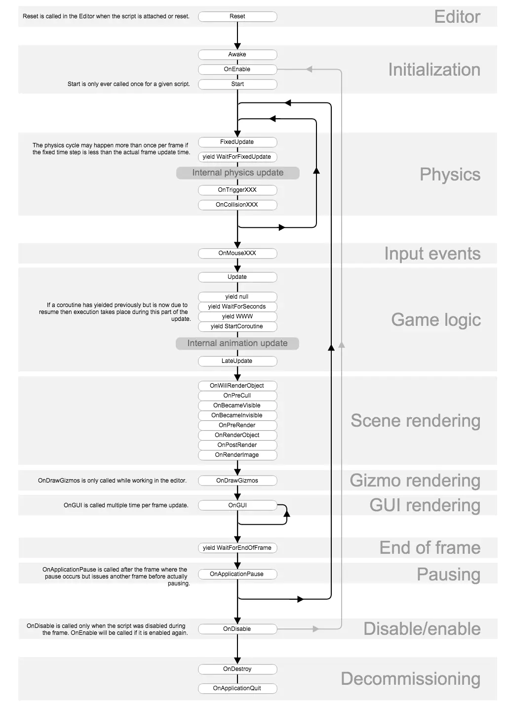

# Mono生命周期

<figure><figcaption></figcaption></figure>

***

[**MonoBehaviour.OnValidate()**](https://docs.unity3d.com/ScriptReference/MonoBehaviour.OnValidate.html)

Editor-only function that Unity calls when the script is loaded or a value changes in the Inspector.

OnDrawGizmosSelected

当前物体在场景中被选中时在Gizmos中的绘制。

OnSceneGUI

在场景视图中启用编辑器来处理事件。

## 调整Time.timeScale的影响。&#x20;

1.timeScale不会影响Update和LateUpdate的执行速度。

2.FixedUpdate是根据时间来的，所以timeScale只会影响FixedUpdate的速度。

3.Update和LateUpdate不是不受影响吗？那怎么就暂停游戏了呢？Update和LateUpdate并没有停，依然在渲染，只是你的代码中依赖于Time.deltaTime的逻辑将会被停掉了，因为Time.deltaTime = 0了。所以游戏看起来是被冻结了。

设置 Time.timeScale 为 0 将会暂停所有和帧率无关的事情。这些主要是指所有的物理事件和依赖时间的函数、刚体力和速度等，而且 FixedUpdate 会被暂停（不是Update），因为FixedUpdate函数是根据时间来进行更新的。

## 细节

但是，Update 函数本身的执行是不会受 Time.timeScale 的影响的。Update 是依赖你的机器的，它的调用次数和你的机器渲染一样快慢（一些特殊情况除外）；性能高的机器，帧率高，Update 函数执行次数也就多。因此，当使用 Time.timeScale = 0 时，游戏看起来是被冻结了，这是因为所有和时间有关的事情都被暂停了。但是，我们的游戏仍在渲染，也就是说 Update 函数仍在执行。无论 Time.timeScale 等于多少，Update 和 LateUpdate 都会去执行。所有的动画都是基于时间来的，因为Time.timeScale ＝ 0了，所以 Time.time 也就不会在变化了。当 Time.timeScale 为 0 时，Time.deltaTime 将为 0。这意味着，如果你使用 Time.deltaTime 来控制旋转和位移等，那Time.timeScale = 0 也将使这些物体停止运动。

如果游戏暂停以后想在暂停界面上继续播放一些不受 Time.timeScale 影响的动画，那么我们就需要用到 Time.realtimeSinceStartup。

Time.timeScale影响的是Unity的游戏时间缩放比例。Unity里面所有跟时间有关系的东西都是根据timeScale来演算的。仔细想想现在的手游就是个 动画 和 粒子技能特效 还有UI位移特效，所以改他们的速度直接用Time.timeScale就可以完成。

我们如果想暂停游戏的话，Time.timeScale = 0 可以暂停游戏，Time.timeScale = 1 恢复正常，但这是作用于整个游戏的设置，不单单是当前场景，记得在需要的时候重置回Time.timeScale = 1。当然也可以使用Time.timeScale来做游戏的1倍、2倍整体加速。

## 参考

1. https://blog.csdn.net/u012366310/article/details/120041102
